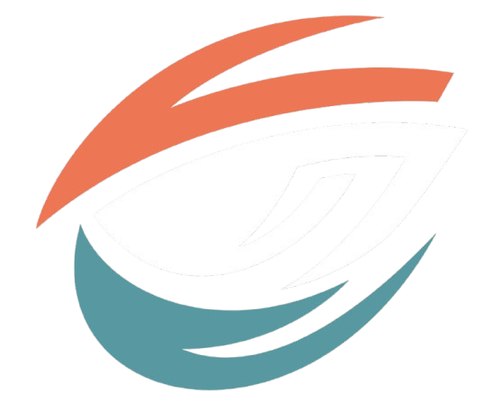
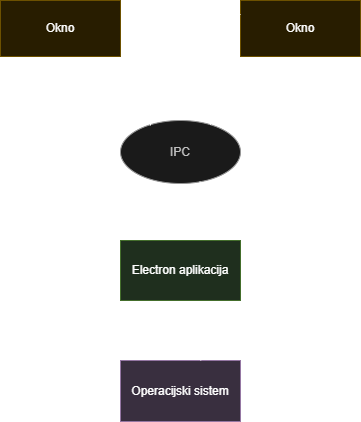
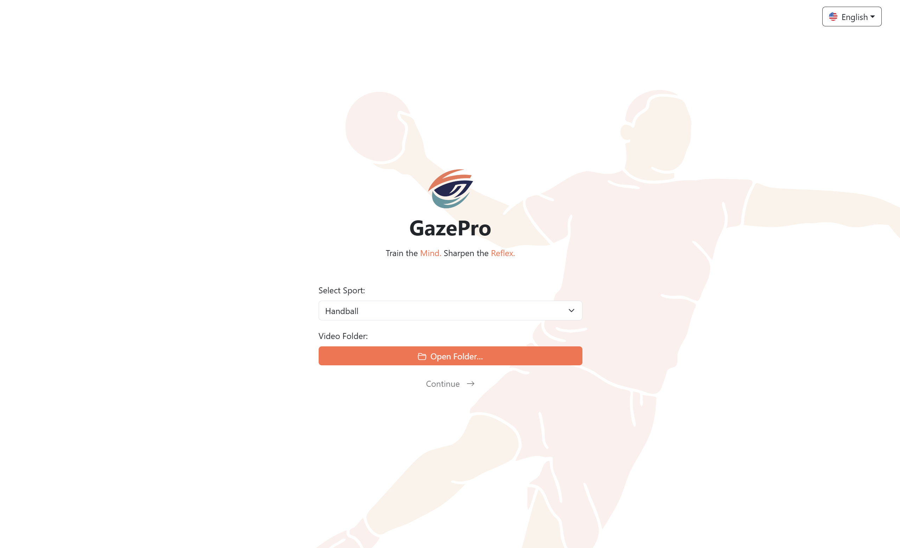
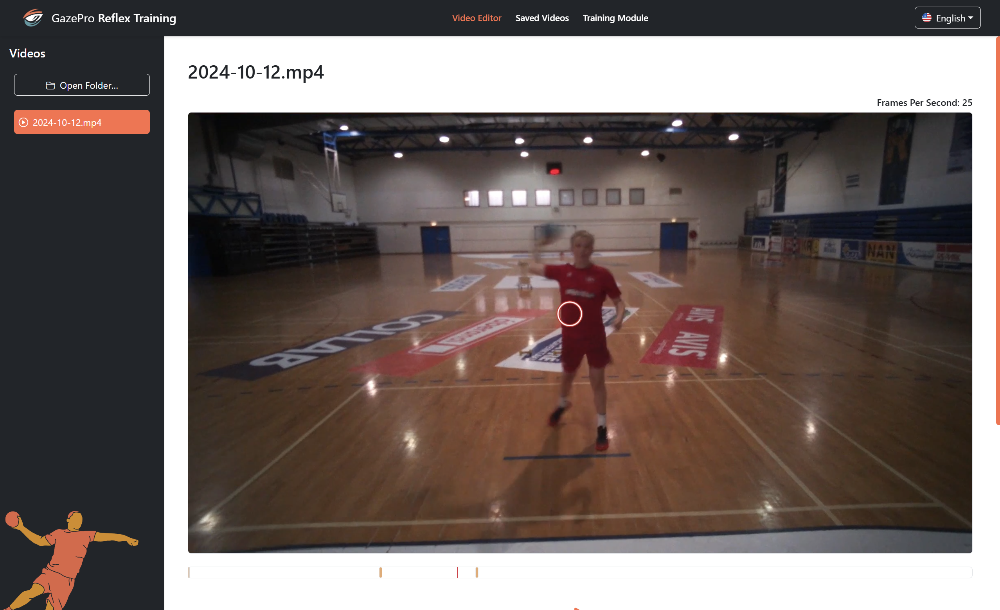
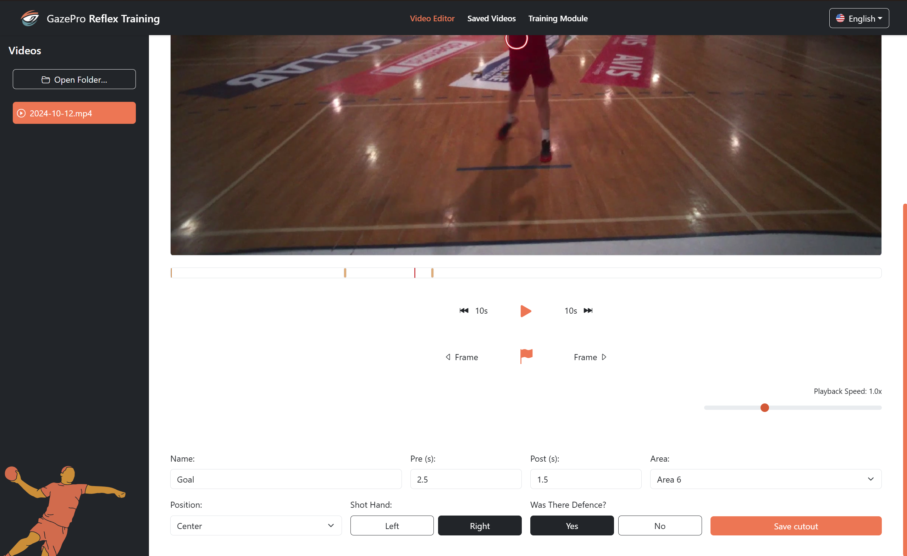
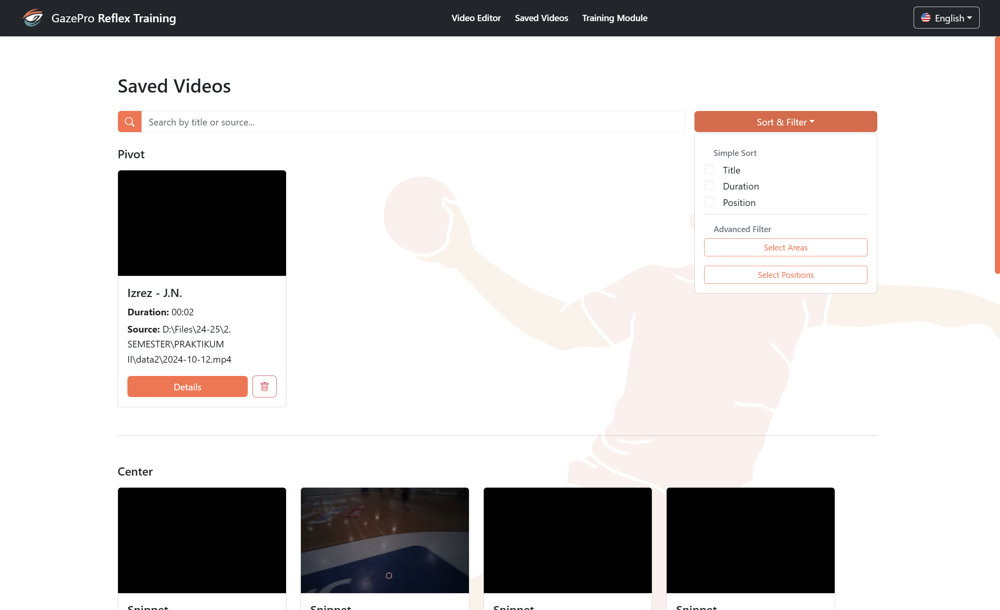
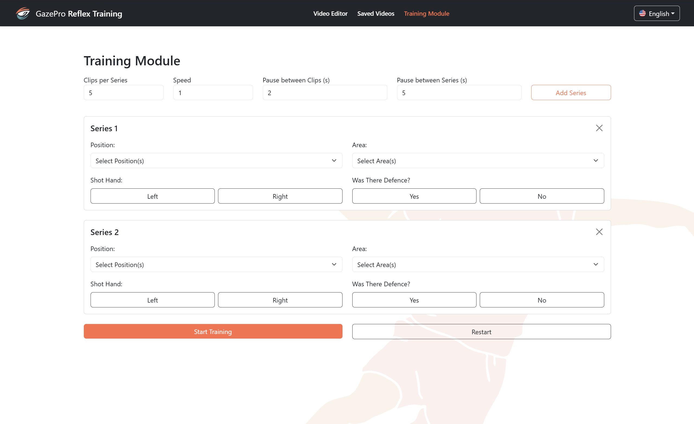

<div align="center">

  
  
  <h1> GazePro Reflex Training </h1>
  
  <p>
    Train the Mind. Sharpen the Reflex.
  </p>

</div>

<br>

**GazePro Reflex Training** is a desktop application designed to support perceptual-reaction training of sports goalkeepers, primarily in handball. The app allows trainers to store, tag, cut, and play video clips as part of customizable training sessions. Developed in collaboration with ŽRK Krim, one of Slovenia’s top handball clubs, it is aimed at enhancing athlete reflexes and situational awareness through real-time feedback and video-based exercises.

<br>

## 🧠 Project Goal

To deliver a training platform that helps handball coaches create perceptual-reaction exercises using real match video material. The application allows for:
- Importing and trimming game footage
- Tagging critical clips with zones, shooter positions, and other metadata
- Organizing clips into training sequences
- Projecting video segments during training
- Capturing athlete responses for post-session analysis

<br>

## ⚙️ Features

### ✅ Video Management
- Upload full-length videos
- Trim segments (cutouts) based on start and end times
- Annotate clips with:
  - Zone (1–9)
  - Shooter position (e.g., Left Wing, Pivot)
  - Shot hand (left/right)
  - Was it defended?

### 🧩 Cutout Tagging
- Fully interactive form for labeling metadata
- Flags to mark critical events
- Tooltip overlays on timeline with auto-scroll to editor

### 🎯 Training Module
- Organize clips into training series
- Customize:
  - Clips per series
  - Playback speed
  - Pause between clips/series
- Play snippets and record expected vs. actual zone
- Keyboard shortcuts for fast input

### 📊 Post-Training Analytics
- Review all responses
- Edit actual responses if needed
- Generate basic statistical summaries of performance

### 🌍 Multilingual Support
- English 🇺🇸
- Slovenian 🇸🇮

<br>

## 🧭 Application Architecture

The GazePro Reflex Training app is structured around Electron, which enables us to build cross-platform desktop apps using web technologies.

The architecture consists of:
- **Renderer Processes** (Windows): Where the user interface is rendered using React and TypeScript.
- **Main Process** (Electron Core): Handles OS-level interactions and native file access.
- **IPC Communication**: Securely bridges communication between the UI and the backend.
- **Local Data Handling**: Using SQLite for persistent, portable storage of video metadata and training responses.
- **Modular Design**: Structured codebase with components, services, and domain-specific modules for scalability and maintainability.

<br>
<div align="center"> 
  
</div>
<br>

This modular architecture enables high testability, platform independence, and seamless integration with local video and file systems.

<br>

## 🧱 Technologies Used

| Layer          | Technology                  |
|----------------|-----------------------------|
| Framework      | Electron + Vite             |
| Frontend       | React, TypeScript           |
| Styling        | Bootstrap                   |
| Icons          | Bootstrap Icons             |
| State          | React Hooks                 |
| Localization   | i18next                     |


### 🔧 Stack Badges

[![Electron][Electron-shield]][Electron-url]
[![Vite][Vite-shield]][Vite-url]
[![React][React-shield]][React-url]
[![TypeScript][TypeScript-shield]][TypeScript-url]
[![Bootstrap][Bootstrap-shield]][Bootstrap-url]
[![Bootstrap Icons][BootstrapIcons-shield]][BootstrapIcons-url]
[![i18next][i18next-shield]][i18next-url]

<br>

## 🧩 External Dependencies

| Dependency | Purpose |
|------------|---------|
| Electron   | Cross-platform desktop application shell |
| Vite       | Frontend bundling and performance |
| React + TypeScript | UI and logic |
| Bootstrap  | UI styling |
| i18next    | Multilingual support |
| SQLite     | Lightweight, embedded database for offline use |
| Node.js    | Runtime for backend logic within Electron |

<br>

## 🛠️ Installation & Getting Started

To set up and run this project locally, follow the steps below:

1. Clone the repository:
   ```bash
   git clone https://github.com/neoxk/gazepro.git
   
    ```

2. Navigate to the project directory:
    ```bash
    cd gazepro
    ```

3. Install dependencies:
    ```bash
    npm install
    ```

4. Run the Application:
    ```bash
    npm run dev
    ```
    
OR

5. Build for Production:

   - For Windows, use:
    ```bash
    npm run build:win
    ```
    - For Linux, use:
    ```bash
    npm run build:linux
    ```
    - For Mac, use:
    ```bash
    npm run build:mac
    ```
    This will generate a distributable version for your OS (Windows/Linux/Mac).

<br>

## 📦 Releases & Portability

You can find the latest working **portable version** of the app under the [Releases](https://github.com/neoxk/gazepro/releases) section on GitHub.

- 💻 **Cross-platform** support (Windows, Mac, Linux)
- 📁 **No installation required** - just extract and run the `.exe` / `.AppImage` / `.dmg` file
- 🗄️ Powered by SQLite to ensure **portability with zero setup**
- 📌 Always download the **latest release** to get the newest features and fixes

> Simply extract the release archive and run the executable – no installation, no database setup. Just plug and play!

<br>

## 📂 Directory Structure
  ```bash
  /src
  ├── main/                             # Electron main process entry
  ├── preload/                          # Preload scripts for Electron context bridging
  ├── renderer/                         # Renderer (frontend) logic
  │   ├── src/
  │   │   ├── assets/                   # Static assets like images and styles
  │   │   │   ├── images/               # Image files (logos, icons, etc.)
  │   │   │   ├── base.css              # Base styling
  │   │   │   └── main.css              # Main styling
  │   │   ├── components/               # React components (UI and layout)
  │   │   ├── core/                     # Business logic and service classes
  │   │   │   ├── modules/              # Structured logic for cutouts/training
  │   │   │   │   ├── fields/           # Field-specific logic
  │   │   │   │   └── handball/         # Handball-related logic
  │   │   │   ├── settings/             # Application settings and config
  │   │   │   ├── const.ts              # Constants and enums
  │   │   │   ├── DBService.ts          # IndexedDB service for persistence
  │   │   │   ├── Initializer.ts        # Startup initialization logic
  │   │   │   ├── TrainingController.ts # Training module logic
  │   │   │   ├── CutoutsController.ts  # Cutout handling logic
  │   │   │   ├── TSFields.ts           # TypeScript types for fields
  │   │   │   ├── TSService.ts          # Shared service logic
  │   │   │   └── util.ts               # Utility functions
  │   │   ├── locales/                  # Translation JSON files
  │   │   ├── App.tsx                   # Root component
  │   │   ├── env.d.ts                  # Environment typings
  │   │   ├── i18n.ts                   # i18next initialization
  │   │   └── main.tsx                  # React renderer entry
  └── index.html                        # HTML entry point for Vite
  ```

<br>

## 🔭 Further Development

Future directions include:

- 🕶️ **VR Integration** for immersive goalkeeper training  
- 👁️ **Eye Tracking Support** for precision-based decision metrics  
- 📊 **Advanced Analytics Dashboards** to evaluate player reflex trends over time  
- 🏑 **Support for Additional Sports** such as hockey, futsal, and football to broaden the application of perceptual training

<br>

## 📸 Screenshots

### 🖼️ Home Page
<div align="center">
  
</div>

### 🏘️ Video Editor
<div align="center">
  
</div>
<div align="center">
  
</div>

### 📝 Saved Videos
<div align="center">
  
</div>

### 📝 Training Module
<div align="center">
  
</div>

<br>

## 👥 Team Members

- Neo Xander Kirbiš
- Gal Petelin
- Ena Imamović

<br>

## 📄 License

Distributed under the MIT License. See `LICENSE.txt` for more information.


[Electron-shield]: https://img.shields.io/badge/Electron-2C2E3B?style=for-the-badge&logo=electron&logoColor=9FEAF9
[Electron-url]: https://www.electronjs.org/

[Vite-shield]: https://img.shields.io/badge/Vite-646CFF?style=for-the-badge&logo=vite&logoColor=white
[Vite-url]: https://vitejs.dev/

[React-shield]: https://img.shields.io/badge/React-20232A?style=for-the-badge&logo=react&logoColor=61DAFB
[React-url]: https://reactjs.org/

[TypeScript-shield]: https://img.shields.io/badge/TypeScript-3178C6?style=for-the-badge&logo=typescript&logoColor=white
[TypeScript-url]: https://www.typescriptlang.org/

[Bootstrap-shield]: https://img.shields.io/badge/Bootstrap-563D7C?style=for-the-badge&logo=bootstrap&logoColor=white
[Bootstrap-url]: https://getbootstrap.com

[BootstrapIcons-shield]: https://img.shields.io/badge/Bootstrap%20Icons-7952B3?style=for-the-badge&logo=bootstrap&logoColor=white
[BootstrapIcons-url]: https://icons.getbootstrap.com/

[i18next-shield]: https://img.shields.io/badge/i18next-26A69A?style=for-the-badge&logo=i18next&logoColor=white
[i18next-url]: https://www.i18next.com/
